<h1 align="center">Hi There, I am Ryan!</h1>

<table>
   <tr>
      <th>Python</th>
      <th>JavaScript</th>
      <th>NodeJS</th>
      <th>TypeScript</th>
   </tr>
</table>

<h2 align="center">👤 ABOUT ME</h2>

I am Ryan, a passionate Python and web programmer from Pakistan, with a penchant for writing clean code and crafting
   impactful applications. My journey into the programming world began with my curiosity for problem-solving, and it has
   since blossomed into a full-fledged career.

<ul>
   <li>💻 I’m currently engrossed in web development projects utilizing Python frameworks such as Django and Flask.</li>
   <li>📚🐍 I'm committed to a continuous learning journey, exploring new technologies and deepening my Python
      expertise.</li>
</ul>
<h2 align="center">💼 SKILLS</h2>
<ul>
   <li><strong>💬 Languages</strong>:</li>
</ul>

   
   
   
   
   
   

<ul>
   <li><strong>🖽 Frameworks</strong>:</li>
</ul>

   
   
   

<ul>
   <li><strong>🗃️ Database</strong>:</li>
</ul>

<ul>
   <li><strong> Version
         Control</strong>:</li>
</ul>

<ul>
   <li><strong>🛠️ Tools:</strong></li>
</ul>

   

<h2 align="center"> Connect with Me</h2>

Everything you need to know about me is in my

   
⚡ STATS ⚡

   

      
      
      
      
      
      
      
   

<h2 align="center">📂 Projects</h2>

Here are some of my noteworthy projects:

   
<strong>1. ryanthedev</strong>

   <ul>
      <li>Description: My own personal website which consists of APIs, My Linktree, Portfolio/Profile, etc</li>
      <li>GitHub Repository: <a href=https://github.com/RyanBaig/ryanthedev>Link</a></li>
      <li>Live Demo: <a href=https://ryanthedev.vercel.app>Link</a></li>
   </ul>

   
<strong>2. BadgeGenerator (Work In Progress)</strong>

   <ul>
      <li>Description: An Easy-to-use generator/customizer for information/custon badges for your <a
            href="badge-generator.ryanbaig.vercel.app/profile_badges">Profile</a>, <a
            href="https://badge-generator.ryanbaig.vercel.app/generate/custom">Custom</a>, or GitHub/any platform
         including <a href="https://crates.io">crates.io</a>, <a href="https://npmjs.com">NPM</a> and <a
            href="https://pypi.org">PyPi</a> and many more coming soon! Badges are generated from <a
            href="https://badgers.space">badgers.space</a> & <a href="https://shields.io">shields.io</a>. Fun Fact: My
         <strong>BIGGEST</strong> web project YET!
      </li>
      <li>GitHub Repository: <a href=https://github.com/RyanBaig/BadgeGenerator>Link</a></li>
      <li>Live Demo: <a href=https://badge-generator.ryanbaig.vercel.app>Link</a></li>
   </ul>

   
<strong>3. ICE POS</strong>

   <ul>
      <li>Description: A Point of Sale (POS) software tailored for my father's courier business. Fun Fact: My
         <strong>BIGGEST</strong> Python project YET!
      </li>
      <li>Repository Link: <a href=https://github.com/RyanBaig/ICEPOS>Github Repository</a></li>
      <li>Screenshots: <a href=https://github.com/RyanBaig/ICEPOS/blob/master/README.md#screenshots>Link</a></li>
   </ul>

   
<strong>4. TerminalTools</strong>

   <ul>
      <li>Description: Terminal Tools is a versatile Python project designed to empower developers and users with a
         collection of command-line utilities. From file management to database handling and web scraping, this toolbox
         simplifies everyday tasks, enhancing productivity and efficiency in the world of backend development. Explore
         the diverse modules within TerminalTools!</li>
      <li>GitHub Repository: <a href=https://github.com/RyanBaig/TerminalTools>Link</a></li>
      <li>Documentation: <a href=https://terminaltools-docs.ryanbaig.vercel.app>Link</a></li>
   </ul>

   
<strong>5. WeatherForecast</strong>

   <ul>
      <li>Description: A weather forecast application utilizing the <a href=https://weatherapi.com>WeatherAPI.com's</a>
         API. Provides weather forecasts for capital cities by inputting either a <strong>City</strong> or
         <strong>Country</strong> name.
      </li>
      <li>Repository Link: <a href=https://github.com/RyanBaig/WeatherForecast>Github Repository</a></li>
      <li>Screenshots: <a href=https://github.com/RyanBaig/WeatherForecast/blob/master/screenshots.JPG>Link</a< /li>
   </ul>

   
<strong>6. Auto-Organizer<strong>

   <ul>
      <li>Description: Swiftly organizes any directory in mere seconds!</li>
      <li>Repository Link: <a href=https://github.com/RyanBaig/Auto-Organizer>Github Repository</a></li>
      <li>Executable: <a href=https://github.com/RyanBaig/Auto-Organizer/blob/main/dist/EXE/EXE/main.exe>Link</a< /li>
   </ul>

   
<strong>7. Password Manager</strong>

   <ul>
      <li>Description: A secure Password Manager.</li>
      <li>Repository Link: <a href=https://github.com/RyanBaig/Password-Manager>Github Repository</a></li>
      <li>Executable: <a href=https://github.com/RyanBaig/Password-Manager/blob/main/dist/main.exe>Link</a< /li>
   </ul>

   
<strong>8. Clock</strong>

   <ul>
      <li>Description: A comprehensive Clock Application featuring functionalities like alarms, a stopwatch, and a
         timer.</li>
      <li>Repository Link: <a href=https://github.com/RyanBaig/Clock>Github Repository</a></li>
      <li>Screenshots: <a href=https://github.com/RyanBaig/Clock#screenshots>Link</a></li>
      <li>Executable: <a href=https://github.com/RyanBaig/Clock/blob/main/dist/clock.exe>Link</a< /li>
   </ul>

   
<strong>9. Rock Paper Scissors</strong>

   <ul>
      <li>Description:A simple yet engaging Rock-Paper-Scissors game with an AI opponent.</li>
      <li>Repository Link: <a href=https://github.com/RyanBaig/Rock-Paper-Scissors>Github Repository</a></li>
      <li>Screenshots: <a href="https://github.com/RyanBaig/Rock-Paper-Scissors#screenshots">Link</a></li>
      <li>Executable: <a
            href=https://github.com/RyanBaig/Rock-Paper-Scissors/blob/main/dist/Rock%20Paper%20Scissors.exe>Link</a<
               /li>
   </ul>

   
<strong>10. Discordia Discord Bot</strong>

   <ul>
      <li>Description: A simple Discord bot I made for a Discord server named <a
            href=https://rg5373429.wixsite.com/discordia>Discordia.</a></li>
      <li>Replit Link: <a href=https://replit.com/@RyanBaig/Discordia-Bot#index.js>Replit Project</a></li>
      <li>Technologies Used: <a href=https://discord.js.org />Discord.js v12, </a><a
            href=https://discord.js.org />Express.js, </a>and <a href=https://github.com/xixi52/discord-canvas#readme>
            Discord-canvas.</a></li>
   </ul>

   
<strong>And Many More!</strong>

   <ul>
      <li>Visit My <a href=codepen.io/Ryan-Baig>CodePen, </a><a href=replit.com/@RyanBaig>Replit </a>or <a
            href=https://github.com/RyanGamingYT?tab=repositories>My Repositories. </a></li>
   </ul>

Many More of my Repositories are pinned below:
